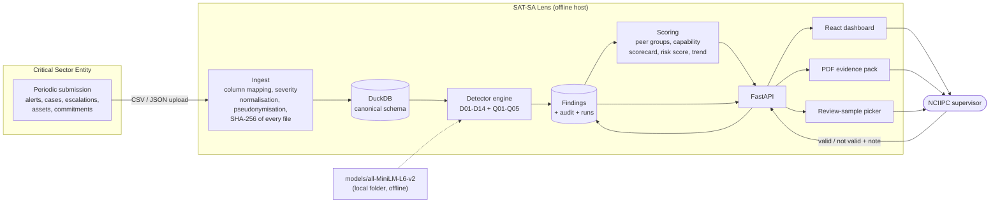

# SAT-SA Lens — architecture

## 1. System shape

No arrow leaves the box. There is no outbound network path at runtime; the
container that holds the model and the database runs on an `internal` Docker
network.

## 2. Data flow

1. **Submit.** A CSE's export arrives as CSV, TSV or JSON in whatever shape its
   tooling produces.
2. **Profile and map.** The file is profiled (column names, value patterns,
   cardinality, null share) and a mapping onto the canonical schema is proposed
   from a combination of name similarity and value shape. Vendor severity
   labels (`P1`, `Sev2`, `4`, …) are mapped onto the canonical five-level scale.
   A supervisor confirms once; the mapping is stored per organisation and reused.
3. **Pseudonymise.** Analyst names, usernames and IP addresses are replaced with
   stable salted SHA-256 tokens *before* any row is written. Free text is
   redacted the same way but keeps artefact shape, so "does this note cite any
   evidence at all?" remains answerable.
4. **Record integrity.** Each file's SHA-256 is stored, and the declared alert
   count in the submission header is reconciled against the rows actually
   supplied.
5. **Detect.** Every detector runs against DuckDB views and emits `Finding`
   objects. A detector that raises is recorded as an error and does not stop
   the run.
6. **Score.** Findings become capability-area scores and one entity risk score,
   with the contributing findings attached.
7. **Review.** The supervisor confirms or dismisses findings; dismissed ones
   stop counting immediately. Everything is written to the audit log.

## 3. Canonical schema

`entities`, `commitments`, `assets`, `alerts`, `cases`, `escalations`,
`submissions` — plus `findings`, `runs`, `audit_log`, `entity_scores`,
`column_mappings` and `review_samples`. Two views (`case_facts`,
`entity_period`) join cases to their alert and first escalation and derive
handling and escalation minutes, so detectors stay short and readable.

## 4. Detector methodology

| ID | What it catches | Method | Capability area |
|---|---|---|---|
| D01 | Critical/high alerts closed too fast to have been investigated | Share closed manually in ≤2 min vs peer median; automated closures excluded and reported separately; Wilson lower bound | Investigation |
| D02 | Criticals closed with no escalation record | Share of closed criticals with no escalation row vs peer median × 3 | Escalation |
| D03 | Performance against the organisation's own declared commitments | Median actual vs declared threshold with a 15% margin; coverage compared in percentage points | Escalation |
| D04 | Copy-paste investigation notes | Distinct note texts embedded (local MiniLM, or deterministic char n-gram TF-IDF + SVD fallback), greedy cosine clustering at 0.92, weighted by case count | Operational discipline |
| D05 | Notes citing no artefact at all | Regex artefact extraction (address, account, hash, host, action verb) vs peer median × 2.5 | Investigation |
| D06 | Same rule on the same asset forever, never remediated | Rule×asset pairs with ≥25 occurrences on ≥15 distinct days, ≥85% closed, zero escalations | Incident response |
| D07 | Effort that does not rise with severity | Median manual handling time, critical ÷ medium, flagged below 1.35 against a peer ratio of ~3.5 | Investigation |
| D08 | Closures bunched just inside an SLA | Count in the last 10% before the declared threshold vs the first 10% after it; ≥3× pile-up | Operational discipline |
| D09 | Implausible per-analyst workload | Closures per analyst per day above max(110, 4× peer typical) | Security operations |
| D10 | Critical assets producing no telemetry | Share of critical assets with ≤1 alert vs peer median + 10pp | Threat detection |
| D11 | Whole attack categories absent | Categories present for ≥80% of peers and entirely absent here; expected volume computed at peer rates | Threat detection |
| D12 | Volume collapse against the entity's own baseline | Last 30 days vs the preceding period, ≥45% drop, baseline ≥5 alerts/day | Security operations |
| D13 | Broken evidence chains | Cases with no parent alert, escalations with no case, confirmed true positives never escalated | Incident response |
| D14 | Unknown patterns | IsolationForest (300 trees, seed 42) over 13 size-invariant features; reported only when ≥2 features also sit ≥2.5 robust-z from the peer median, and those features are the explanation | Cyber resilience |
| Q01 | Blocks of missing record IDs | Longest contiguous ID run ≥60 in an otherwise ≥97% dense ID space | Governance oversight |
| Q02 | Missing days | Calendar gaps of ≥3 days with no records | Governance oversight |
| Q03 | Declared vs actual row counts | Header count vs rows supplied, 2% tolerance | Governance oversight |
| Q04 | Timestamps that look generated | Share landing exactly on the hour against the ~1/3600 you would expect | Governance oversight |
| Q05 | Submissions with no file hash | Presence of a usable SHA-256 | Governance oversight |

### Fair comparison

The peer group is **sector + size tier**. Supervisory portfolios are small, so
when fewer than three other members qualify the comparison widens to the sector,
then the size tier, then the whole portfolio — and every finding records which
level was used, so the supervisor can judge the comparison for themselves.
Medians (not means) are used throughout so a handful of deviant peers cannot
drag a baseline. Rates are normalised per asset, per analyst and per 1,000
alerts. Small samples are protected by a per-detector minimum row count and a
Wilson lower bound, and confidence never reaches 1.0.

### Scoring

`weight = severity_weight (high 30 / medium 18 / low 9) × confidence`.

- Capability score per area: `100 × exp(−Σweight / 34)`, so 100 means nothing
  was flagged there.
- Entity risk: `100 × (1 − exp(−Σweight / 62))`, bands High ≥60, Medium ≥30.
  Monotone by construction — adding a finding, or raising its severity or
  confidence, can only raise the score. There is a test for that.
- Trend: each finding's weight is allocated across 30-day windows in proportion
  to where its own evidence rows fall in time, which is what makes the trend
  arrow mean something.
- Only `open` and `valid` findings count. Dismissing one re-scores immediately.

## 5. ML model details

| | |
|---|---|
| **Model** | `sentence-transformers/all-MiniLM-L6-v2` — 6-layer MiniLM bi-encoder, 384-dimensional sentence embeddings, ~90 MB, ~22M parameters |
| **Second model** | scikit-learn `IsolationForest`, 300 trees, `random_state=42`, over 13 hand-built size-invariant features |
| **Training** | Neither model is trained on CSE data. MiniLM is used as a frozen, pre-trained encoder; IsolationForest is fitted at run time on the current portfolio only (12 rows in the reference corpus) and never persisted |
| **Hardware** | CPU only. No GPU, no accelerator. 4 GB RAM is enough for the full 186k-alert corpus |
| **Inference** | Entirely local. `HF_HUB_OFFLINE=1`, `TRANSFORMERS_OFFLINE=1`, `HF_DATASETS_OFFLINE=1` are set before the library is imported, and the model is loaded from a path, never an identifier |
| **Fallback** | If the model folder is absent, D04 uses a deterministic character n-gram TF-IDF + TruncatedSVD embedding. Every finding records `embedding_method`, so which path ran is always visible. `SATSA_REQUIRE_MODEL=1` turns absence into a hard error |
| **Updates** | A new model is delivered as a signed offline bundle: the model folder plus a manifest of SHA-256 digests, carried on removable media, verified on the target host, and dropped into `models/`. The application version and the rule-set version are recorded on every run, so a supervisor can always tell which model produced which finding. Nothing auto-updates |
| **Explainability** | D04 reports cluster sizes, the share of notes in duplicate clusters and example note text. D14 reports the anomaly score plus the top deviating features with their values, the peer median and a robust z-score, each translated into plain English. Neither model is allowed to produce a finding on its own numbers alone — both are gated behind explicit thresholds and peer comparison |
| **Auditability** | Every run stores the code version, rule-set version, git commit, random seed and input data hash. Identical input plus identical code produces byte-identical findings |
| **Bias control** | Only size-invariant features feed D14, so a small organisation is not flagged for being small — and the corpus includes a small "innocent look-alike" entity specifically to test that |

## 6. Validation methodology

The generator is the ground truth. Each faulty organisation receives 3–5
documented, deliberately planted weaknesses, written to `data/ground_truth.json`
with the detector that should catch each one and the affected record IDs. Three
organisations are left fully healthy and two are built as innocent look-alikes.

`app.validation.run` matches findings to planted problems by
`(entity, detector)` and reports per-detector planted / caught / missed / false
positives, plus overall recall and precision. A finding counts as a false
positive only when it is neither planted nor a *declared* knock-on effect of a
planted weakness — those links are declared by the generator, never inferred by
the scorer, and D14 is additionally acceptable on any organisation carrying two
or more planted problems, because such an organisation genuinely is an outlier.

This mirrors the manual process it supports: an expert reviews a sample by hand,
forms a conclusion, and then checks whether the tool reached the same one.

## 7. Failure and safety behaviour

- A detector that raises is caught, logged to the audit trail with its exception
  and skipped; the run completes and the remaining detectors still report.
- A detector with too little data stays silent rather than guessing.
- No finding can be created without a rationale, metrics, evidence IDs, a
  confidence and an innocent explanation — the `Finding` model requires them and
  a test enforces it across the whole corpus.
- Status is supervisor-controlled only. Nothing in the system concludes that an
  organisation has failed.
